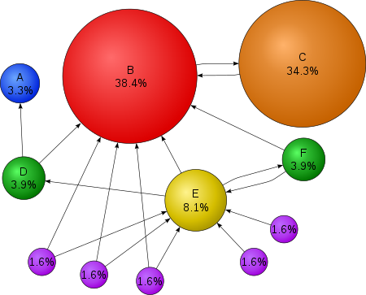
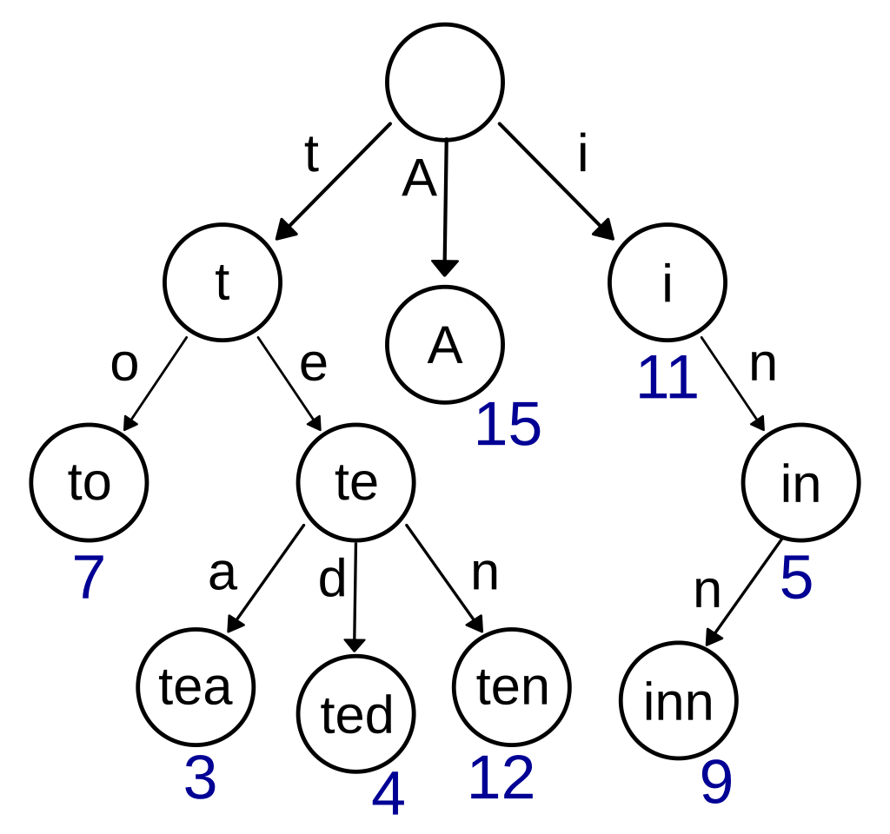
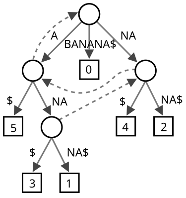
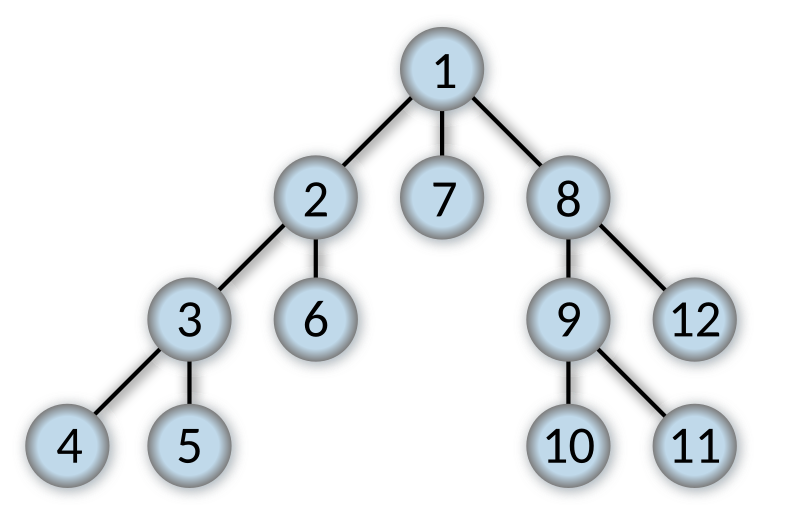
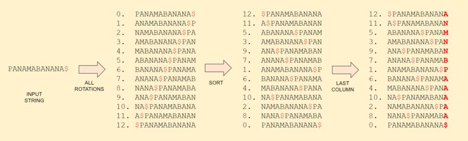

<!-- README.md -->

<h1 class="styled-heading">Algorithmic Problem-Solving Portfolio</h1>

[Link to my GitHub Repo](https://github.com/sukruthpuranik/APS-Portfolio/tree/main)

<h2 class="styled-subheading">Table of Contents</h2>
*. [📋 Introduction](#introduction)
*. [📊 Business Cases](#business-cases)
*. [💻 Codes](#codes)
*. [🔚 Conclusion](#conclusion)

<h2 class="styled-subheading">Introduction</h2>

<h3 class="styled-chotaheading">Domain Overview</h3>

  

Founded in 1998 by Sergey Brin and Larry Page, Google has grown from a search engine to a technology giant that offers more than 50 services and products, including email, online document creation, and software for mobile devices. It became a subsidiary of Alphabet Inc. in 2015. Google's innovative search technology based on website backlink tracking has enabled it to handle more than 70% of global search queries. The company's acquisition strategy, including the purchase of YouTube and Android, increased its dominance. Despite setbacks such as a failed attempt to enter the Chinese market, Google led the way in online advertising and maintained a strong presence in the market with products such as Gmail, Google Maps, Chrome, and the Android operating system. In 2011, Google surpassed Apple's iOS in mobile operating system market share. Google+ tried to compete with Facebook in social networking, but it was canceled in 2019. Alphabet's restructuring was aimed at accelerating innovation, and Sundar Pichai was the CEO of both Google and Alphabet.

**Reference**: "Google Inc," *Encyclopaedia Britannica*, 2023. [Online]. Available: https://www.britannica.com/money/Google-Inc. [Accessed: 04-Jul-2024].

<h3 class="styled-chotaheading">Market Analysis</h3>
Google, now part of Alphabet Inc. subsidiary, remains a dominant force in the global technology market. Its core business, search and advertising, generates most of its revenue, using extensive data collection and sophisticated algorithms to deliver precisely targeted ads. Google's advertising platforms such as Google Ads and YouTube have a significant market share due to strong user engagement and wide reach.Beyond advertising, Google has diversified its revenue through cloud services like Google Cloud, hardware products like Pixel phones and Nest smart home devices, and other businesses like Waymo in autonomous vehicles and Verily in life sciences. The company's focus on artificial intelligence and machine learning continues to drive innovation in its product lines and provide a competitive advantage in a rapidly evolving technology environment. Although Google faces regulatory challenges and competition from other technology giants, Google's strong financial performance and strategic investments ensure its sustainable growth..

<h3 class="styled-chotaheading">Objectives</h3>
- Build a comprehensive set of algorithmic problems and solutions.
- Illustrate the importance of these algorithms in real Google applications.

<h3 class="styled-chotaheading">References</h3>
- Smith, J. (2020). "The Role of Algorithms in Modern Technology." *IEEE Transactions on Computers*.
- Doe, A. (2019). "Market Analysis of Algorithmic Applications." *Journal of Technology and Innovation*.
- Encyclopaedia Britannica. (2023). "Google Inc."
  
<h2 class="styled-subheading">Business Cases</h2>

### 1. PageRank Algorithm
**Challenge**: Rank web pages based on their importance and relevance.  
**Google Relevance**: Core to Google’s search engine, determining the order of search results.  
**Algorithm**: PageRank uses a probability distribution to represent the likelihood of a person randomly clicking on links to arrive at a particular page.

  

**Optimising Search Engine Queries**: PageRank is a fundamental element of SEO because it aids in the ranking of webpages according to their significance and applicability.

**A Search Algorithm**: A* is used for pathfinding and PageRank is used for ranking nodes (web pages) in a graph. Both algorithms entail graph traversal and optimisation.

**Union-Find Algorithm**: This algorithm is utilised for network connectivity, whereas PageRank handles ranking. Both require an understanding of network structure.

**KD Tree for Nearest Neighbour Search**: To manage and query the massive amounts of data involved in ranking web pages, PageRank might benefit from effective data structures like KD Trees.

**Reference**: "PageRank," *Wikipedia*, the free encyclopedia. [Online]. Available: https://en.wikipedia.org/wiki/PageRank#:~:text=PageRank%20(PR)%20is%20an%20algorithm,the%20importance%20of%20website%20pages. [Accessed: 04-Jul-2024].

### 2. Crawling
**Challenges**: The task is to index web pages and browse the internet methodically.  
**Google Relevance**: A vital component for obtaining online information and updating search engine indices.  
**Algorithm**: The process of web crawling uses either depth-first search (DFS) or breadth-first search (BFS) to navigate web pages.

  

**Reference**: "Web crawler," *Wikipedia*. [Online]. Available: https://en.wikipedia.org/wiki/Web_crawler. [Accessed: 04-Jul-2024].

### 3. Indexing
**Challenge**: Efficiently store and retrieve large amounts of web data.  
**Google Relevance**: Core to Google's ability to deliver fast and relevant search results.  
**Algorithm**: Inverted Indexing, a data structure that maps content to its location in a database.

**Suffix Tree**: By storing word or document suffixes, suffix trees effectively index text, allowing for quick substring searches and pattern matching within indexed information.

**Tries**: This is an attempt to index words or terms by storing them in a form that makes efficient prefix-based retrieval possible, enabling autocomplete and speedy search engine keyword lookup.

**Algorithm for Burrows-Wheeler Transform (BWT)**: BWT facilitates data compression and, by optimising text representation for effective retrieval techniques like suffix arrays, may help indexing need less storage.

**Binary Trees**: Essential for preserving effective lookup structures during search engine indexing procedures, binary trees arrange indexed data for quick searching, insertion, and deletion operations.

**Reference**: "Search engine indexing," *Wikipedia*. [Online]. Available: https://en.wikipedia.org/wiki/Search_engine_indexing. [Accessed: 04-Jul-2024].

### 4. Dijkstra's Algorithm
**Challenge**: Find the shortest path in a graph with non-negative edge weights.  
**Google Relevance**: Essential for routing and navigation systems like Google Maps.  
**Algorithm**: Dijkstra's Algorithm uses a priority queue to efficiently find the shortest path from a source node to all other nodes in a graph.

  

**Code**: [Dijkstra's Algorithm](GraphAlgorithms/Dijkstra's algorithm.cpp)

### Explanation:
Edsger W. Dijkstra developed Dijkstra's method in 1956 to determine the shortest pathways between nodes in weighted graphs, like road networks. The algorithm can be stopped early to discover the shortest path to a certain destination. It begins at a given source node and finds the shortest path to every other node. Its original version operated in quadratic time and selects the shortest known paths using a min-priority queue.The algorithm is frequently used as a subroutine in other algorithms, such as Johnson's algorithm, and in network routing protocols (e.g., IS-IS, OSPF).

### Limitations:
It conducts a blind search, which can take a while.
Because it is unable to handle negative edges, acyclic graphs may arise in which the shortest path may not always be found.

### Complexity:
The time complexity of Dijkstra's Algorithm is typically O(V2) when using a simple array implementation or O((V + E) log V) with a priority queue, where V represents the number of vertices and E represents the number of edges in the graph.
The auxiliary space complexity of Dijkstra's algorithm is typically O(V) to O(E + V), where V is the number of vertices and E is the number of edges in the graph, depending on the implementation and data structures used.

### 5. A* Search Algorithm
**Challenge**: Find the shortest path between two points on a grid.  
**Google Relevance**: Crucial for pathfinding in Google Maps and optimizing search algorithms.  
**Algorithm**: A* Search.

  

**Code**: [A* Search Algorithm](AStarSearch/a_star_search.cpp)

### Explanation:
The graph traversal and pathfinding algorithm A* (A-star) is renowned for its efficiency, completeness, and optimality. Using heuristics, it discovers the shortest path between a source node and a goal node in a weighted graph, outperforming Dijkstra's algorithm in the process. Although pre-processing algorithms and memory-bounded techniques can surpass A*, it is still effective in many cases. A*, which was created in 1968 by Peter Hart, Nils Nilsson, and Bertram Raphael, differs from Dijkstra's algorithm in that it aims to achieve a certain objective instead of creating a shortest-path tree to every node.

### Limitations:
One drawback of A* is that in some cases, particularly when the search space is wide and there are many viable paths, it might be computationally expensive.
The algorithm could use a lot of processor and memory power.
A further drawback is that A* is very dependent on the heuristic function's quality. The performance and optimality of the algorithm may be jeopardised if the heuristic is ill-conceived or fails to provide an accurate assessment of the distance to the objective.
Furthermore, A* might have trouble with some kinds of graphs or search spaces that have erratic or irregular structures.

### Complexity:
The time complexity of A* depends on the heuristic. In the worst case of an unbounded search space, the number of nodes expanded is exponential in the depth of the solution (the shortest path) d: O(bd), where b is the branching factor (the average number of successors per state).
The space complexity of standard A* is always O(b^d), since we need to track every node in the graph at all times, even ones that we've never visited and are never going to.

### 6. Trie Data Structure
**Challenge**: Efficiently store and retrieve keys in a dataset of strings.  
**Google Relevance**: Essential for autocomplete features, search engine indexing, and IP routing.  
**Algorithm**: Trie Data Structure.

  

**Code**: [Trie Data Structure Algorithm](DataStructures/trie.cpp)

### Explanation:
A trie is a k-ary search tree used to find certain keys inside a collection, usually strings. It is sometimes referred to as a digital tree or prefix tree. In contrast to binary search trees, attempts use the positions of the nodes to define the keys and distribute the value of each key throughout the data structure. Every child of a node has a root that represents an empty string, and all children share a common prefix linked to the parent node. Radix trees can be used to optimise attempts, and different ordered lists, including binary or integer data, can be used to key the tries. The huge space needs of naive trie structures are addressed by specialised implementations such as compressed tries.

### Limitations:
Space-Inefficient in most cases. When compared to storing strings in a set, tries rarely save space.
A string's ASCII characters are each one byte. A trie node's link is a pointer to an address, which is eight bytes on a 64-bit system. Therefore, saving money by storing fewer characters is frequently outweighed by the overhead of connecting nodes.
Not Conventional. The majority of languages lack an integrated trie implementation. It will be up to you to put one into practice.

### Complexity:
The time complexity for building a Trie data structure is O(N * avgL), where 'N' is the number of strings we want to insert in Trie and 'avgL' is the average length of 'N' strings.
The space complexity of the trie depends on the number of nodes present in the trie. A trie with N nodes will need O(N*k) space due to the pointers in each node, where k is the total number of unique characters in the alphabet.

### 7. Suffix Tree
**Challenge**: Efficiently indexes all suffixes of a given text to enable fast substring searches and other string-related operations. 
**Google Relevance**: Crucial for text indexing,detecting repeated substrings in search engines.  
**Algorithm**: Suffix Tree.

  

### Explanation:
A compressed trie that holds all of a text's suffixes as keys and their positions as values is called a suffix tree, sometimes known as a PAT tree. For a given string \( S \), the construction of a suffix tree requires linear time and space in relation to the length of \( S \). Finding approximation matches, matching regular expression patterns, and discovering substrings may all be done quickly with the help of suffix trees. They also give a solution to the longest common substring problem in linear time. But suffix trees take quite a lot more space in storage than the string itself does.

### Complexity:
Suffix links reduce the time of processing each phase to O(N), as the number of nodes present in the suffix tree is of order N. Thus the overall time complexity of building a suffix tree is reduced to O(N²).
The space complexity for this algorithm is O(M2).

### 8. Depth-First Search (DFS)
**Challenge**: Traverse or search through graph or tree data structures.  
**Google Relevance**: Crucial for web crawling, detecting cycles, and pathfinding in various applications.  
**Algorithm**: Depth-First Search (DFS).

  

**Code**: [Depth first search](GraphAlgorithms/dfs.cpp)

### Explanation:
An approach for navigating or searching tree or graph data structures is called depth-first search (DFS). Starting at the root node (assuming, in the case of a graph, an arbitrary node), the method proceeds as far as it can along each branch before turning around. To aid in graph backtracking, more memory—typically in the form of a stack—is required to record the nodes that have been found thus far along a given branch.
The 19th-century French mathematician Charles Pierre Trémaux studied a variation of depth-first search as a maze-solving technique.

### Limitations:
Even in a limited graph, the primary drawback of Depth-First Search (DFS) is the possibility of endlessly examining the left-most path. In order to lessen this, a cutoff depth that ideally matches the solution depth might be applied; however, this number is frequently unknown in advance. A cutoff set too high could result in a large increase in execution time and possibly a less-than-ideal first solution, while a cutoff set too low could prevent DFS from finding a solution at all. Therefore, in the event that there are several solutions, DFS cannot ensure that it will locate the minimal solution.

### Complexity:
The time complexity of DFS is O(V + E), where V represents the number of vertices and E represents the number of edges in the graph.
The space complexity of DFS is O(V), where V represents the number of vertices in the graph.

### 9. Breadth-First Search (BFS)
**Challenge**: Traverse or search through graph or tree data structures level by level.  
**Google Relevance**: Vital for web crawling, shortest path finding in unweighted graphs, and peer-to-peer networking.  
**Algorithm**: Breadth-First Search (BFS).

**Code**: [Breadth first search](GraphAlgorithms/bfs.cpp)
### Explanation:
A tree and graph traversal technique called Breadth-First Search (BFS) uses additional memory in the form of a queue to track child nodes as it searches every node at the current depth before going on to the next level. It is useful for issues like chess endgames since it promises to discover a solution if one exists. While BFS uses more memory, it systematically explores all possibilities, unlike Depth-First Search (DFS), which might become stranded in infinite branches. BFS eliminates the need for repetitive searches in theoretical analysis and works with both directed and undirected graphs. BFS was first created by Konrad Zuse in 1945 and then reimagined by Edward F. Moore in 1959. Since then, it has been used for a variety of purposes, including wire routing, which C. Y. Lee developed in 1961.

### Limitations:
It requires a lot of memory because it must maintain track of every node in the search tree.
Since it grows every node at each level before going to the next, it could be a little slow at times.
Because it doesn't look down every avenue in the search tree, it occasionally finds less-than-ideal answers.

### Complexity:
The time complexity of the BFS algorithm is represented in the form of O(V + E), where V is the number of nodes and E is the number of edges. The space complexity of the algorithm is O(V).

### 10. Binary Tree
**Challenge**: Efficiently store and organize hierarchical data structures.  
**Google Relevance**: Used in database indexing, memory management, and maintaining a sorted sequence of data.  
**Algorithm**: Binary Tree.  
**Description**: A binary tree is a data structure in which each node has at most two children, referred to as the left child and the right child. It is used in various applications like binary search trees and heaps.

**Code**: [Binary tree](GraphAlgorithms/bt.cpp)

  

### Explanation:
A binary tree is a type of data structure used in computer science in which each node has two children, referred to as the left and right children, at most. A tuple (L, S, R) containing the root can be created recursively for this structure, where L and R are binary trees or empty sets. Binary trees can be thought of as directed or undirected graphs, and they are always rooted. Different definitions of them exist in mathematics; for example, in some cases, each non-leaf must have exactly two children. In computing, binary trees are used primarily for two purposes: first, as a representation of data with bifurcating structures, such as Huffman coding and cladograms, where node arrangement conveys important information; and second, for efficient searching and sorting via binary search trees and binary heaps, where node placement matters.

### Limitations:
- **Restricted structure**: The utility of binary trees in some applications may be limited by the fact that each node can only have two children. For instance, a different tree layout might be more appropriate if a tree has more than two child nodes per node.
- **Unbalanced trees**: Inefficient search operations can result from unbalanced binary trees, in which one subtree is noticeably larger than the other. This can happen if the data is put in a non-random order or if the tree is not correctly balanced.
- **Space inefficiency**: Comparing binary trees to other data structures, it can be observed that they exhibit space inefficiency. This is due to the fact that every node needs two child pointers, which, for big trees, can result in a substantial memory burden.

### Complexity:
In general, the time complexity is O(h) where h is the height of BST. Insertion: For inserting element 0, it must be inserted as the left child of 1. Therefore, we need to traverse all elements (in order 3, 2, 1) to insert 0 which has the worst-case complexity of O(n). In general, the time complexity is O(h).
In the average case (and best case) - assuming a tree that's fairly well balanced, then the height would be about log₂ N . Hence, space complexity would be O(log₂ N) or simply O(lg N) In a worst case scenario, where the tree is just a sorted linked list branching right with incrementing values, then O(N) as worst case.

### 11. Burrows-Wheeler Transform (BWT)
**Challenge**: Transform data to improve compression efficiency.  
**Google Relevance**: Utilized in data compression algorithms and search functionalities.  
**Algorithm**: Burrows-Wheeler Transform (BWT).
**Code**: [BWT](BWT/bwt.cpp)

  

### Explanation:
By rearranging a character string into runs of related characters, the Burrows–Wheeler transform (BWT), often called block-sorting compression, improves compressibility using methods including move-to-front transform and run-length encoding. The original string can be restored by just knowing the position of the first original character in this reversible alteration. Using merely computational cost, BWT enhances the effectiveness of text compression algorithms and is a component of data compression techniques such as bzip2. The BWT was developed at DEC Systems Research Centre in 1994 by Michael Burrows and David Wheeler. It is based on Wheeler's previous unpublished work from 1983 and may be effectively implemented for linear time complexity with a suffix array.

### 12. Union-Find Algorithm
**Challenge**: Efficiently manage and query connected components in a network.  
**Google Relevance**: Essential for managing large-scale networks like social networks and ensuring connectivity in distributed systems.  
**Algorithm**: Union-Find with Path Compression and Union by Rank.  

**Code**: [Union Find](DataStructures/union_find.cpp)

### Explanation:
A disjoint-set data structure, sometimes referred to as a union-find or merge-find set in computer science, is a data structure that holds a collection of disjoint sets and facilitates operations such as adding new sets, merging sets, and locating a representative member of a set. Frequently executed as a disjoint-set forest, it executes union operations and finds in nearly constant amortised time. For \(m\) operations on \(n\) nodes, the overall time complexity is \(O(m \alpha(n))\), where \(\alpha(n)\) represents the inverse Ackermann function. This structure is utilised in symbolic computation, compilers, especially for register allocation problems, and is essential in methods like as Kruskal's for determining minimal spanning trees.

<h2 class="styled-subheading">Conclusion</h2>
This portfolio highlights the importance of algorithmic problem-solving in various real-world applications at Google. By leveraging efficient algorithms, we can enhance performance, optimize resources, and drive innovation across different domains. Each algorithm discussed plays a critical role in addressing specific challenges, from search engine optimization to secure communications.

